March 15 2017

**Notes**: for Gleim Private Pilot FAA Knowledge Test

# Chapter 1 - Aerodynamics

[Mind Map](assets/gleim_ch1_aerodynamics.pdf)

[Terms](https://www.faa.gov/regulations_policies/handbooks_manuals/aviation/phak/media/21_phak_glossary.pdf)

## Flight Controls

* PHAK [CH6 Flight Controls](https://www.faa.gov/regulations_policies/handbooks_manuals/aviation/phak/media/08_phak_ch6.pdf)
	* [Audio Primary Flight Controls](http://ia801308.us.archive.org/35/items/pilotshandbook_1512_librivox/pilotshandbook_16_faa_128kb.mp3)
	* [Audio Secondary Flight Controls](http://ia801308.us.archive.org/35/items/pilotshandbook_1512_librivox/pilotshandbook_17_faa_128kb.mp3)


* Primary Flight Controls ([video](https://www.youtube.com/watch?v=w7c2H9yUxpQ)
	* Ailerons - longitudinal axis control (roll)
	* Elevator - lateral axis control (pitch)
	* Stabilator - one piece horizontal stabilizer
	* Rudder - Vertical access control
	* Canard - lateral axis control (pitch)
* Secondary Flight Controls
	* Flaps - Increase angle of descent without increase in airspeed
	* Spoiler - 
	* Trim System - 

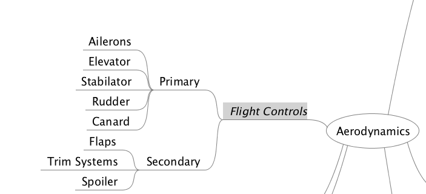

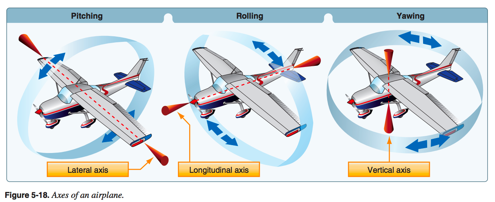

### Aileron

Primary flight control surfaces mounted on the trailing edge of an airplane wing, near the tip. Ailerons control roll about the longitudinal axis.

### Elevator

[Elevator](https://en.wikipedia.org/wiki/Elevator_(aeronautics)) The horizontal, movable primary control surface in the tail section, or empennage, of an airplane. The elevator is hinged to the trailing edge of the fixed horizontal stabilizer.


### Stabilator

[Stabilator](https://en.wikipedia.org/wiki/Stabilator) A single-piece horizontal tail surface on an airplane that pivots around a central hinge point. A stabilator serves the purposes of both the horizontal stabilizer and the elevators.


### Rudder

**Rudder**. The movable primary control surface mounted on the trailing edge of the vertical fin of an airplane. Movement of the rudder rotates the airplane about its vertical axis.

### Canard

**Canard**. A horizontal surface mounted ahead of the main wing to provide longitudinal stability and control. It may
be a fixed, movable, or variable geometry surface, with or without control surfaces.


**Canard configuration**. A configuration in which the span of the forward wings is substantially less than that of the main wing.

### Flaps

Flaps. Hinged portion of the trailing edge between the ailerons and fuselage. In some aircraft ailerons and flaps are interconnected to produce full-span “flaperons.” In either case, flaps change the lift and drag on the wing.


### Spolier

**Spoilers**. High-drag devices that can be raised into the air flowing over an airfoil, reducing lift and increasing drag. Spoilers are used for roll control on some aircraft. Deploying spoilers on both wings at the same time allows the aircraft to descend without gaining speed. Spoilers are also used to shorten the ground roll after landing.

### Trim System

**Trim**. To adjust the aerodynamic forces on the control surfaces so that the aircraft maintains the set attitude without any control input.

**Trim tab**. A small auxiliary hinged portion of a movable control surface that can be adjusted during flight to a position resulting in a balance of control forces.


## Aerodynamic Forces


* PHAK [CH5 Aerodynamics
of Flight](https://www.faa.gov/regulations_policies/handbooks_manuals/aviation/phak/media/07_phak_ch5.pdf)
	* [Audio](http://ia801308.us.archive.org/35/items/pilotshandbook_1512_librivox/pilotshandbook_08_faa_128kb.mp3)


* Forces acting on airplane during flight
	* Lift - Upward acting force
	* Weight - The downward acting force
	* Thrust - Forward acting Force
	* Drag - The rearward acting force


There are the force vectors in relation to an airplane:

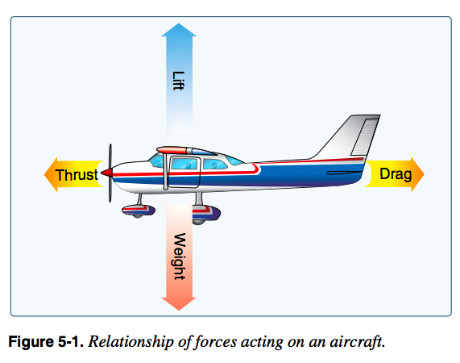


This refinement of the old “thrust equals drag; lift equals weight” formula explains that a portion of thrust is directed upward in climbs and slow flight and acts as if it were lift while a portion of weight is directed backward opposite to the direction of flight and acts as if it were drag. In slow flight, thrust has an upward component. But because the aircraft is in level flight, weight does not contribute to drag. 

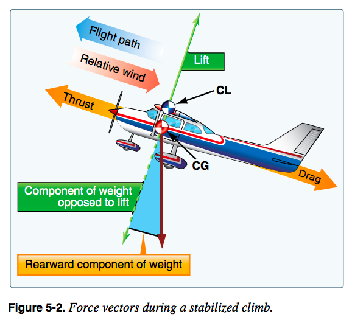


	
[Bernoulli's Principle](https://www.grc.nasa.gov/www/k-12/airplane/bern.html): ```Static Pressure + Dynamic Pressure = Total Pressure```


* [Vortex Shedding - Smarter Every Day 23](https://www.youtube.com/watch?v=ZauGjgZ0rBQ)
* [How Does A Wing Actually Work?](https://www.youtube.com/watch?v=aFO4PBolwFg) - The real story
* [Common Misconceptions in Aerodynamics](https://www.youtube.com/watch?v=QKCK4lJLQHU)
* [Cambridge scientist debunks flying myth](http://www.telegraph.co.uk/news/science/science-news/9035708/Cambridge-scientist-debunks-flying-myth.html)


## Lift

Theories in the Production of Lift In order to achieve flight in a machine that is heavier than air, there are several obstacles we must overcome. One of those obstacles, discussed previously, is the resistance to movement called drag. The most challenging obstacle to overcome in aviation, however, is the force of gravity. A wing moving through air generates the force called lift, also previously discussed. Lift from the wing that is greater than the force of gravity, directed opposite to the direction of gravity, enables an aircraft to fly. Generating this force called lift is based on some important principles, Newton's basic laws of motion, and Bernoulli's principle of differential pressure. Newton’s Basic Laws of Motion
The formulation of lift has historically been an adaptation over the past few centuries of basic physical laws. These laws, although seemingly applicable to all aspects of lift, do not explain how lift is formulated. In fact, one must consider the many airfoils that are symmetrical, yet produce
significant lift. 


## Angle Of Attack (AOA)

* PHAK [CH6-4 Angle of Attack](https://www.faa.gov/regulations_policies/handbooks_manuals/aviation/phak/media/08_phak_ch6.pdf)


**Angle of attack**. The angle of attack is the angle at which relative wind meets an airfoil. It is the angle that is formed by the chord of the airfoil and the direction of the relative wind or between the chord line and the flight path. The angle of attack changes during a flight as the pilot changes the direction of the aircraft and is related to the amount of lift being produced. 


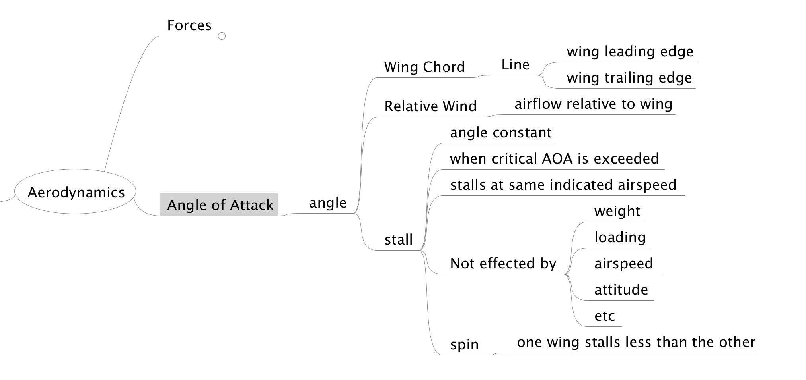

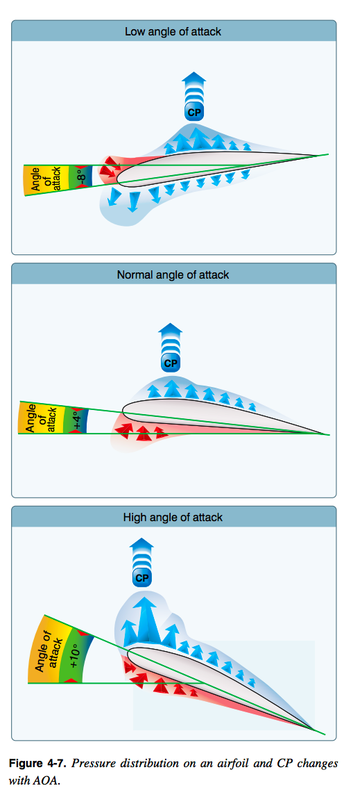
CP= Center of Pressure 


## Stalls and Spins

**Stall**. A rapid decrease in lift caused by the separation of airflow from the wing’s surface, brought on by exceeding the critical angle of attack. A stall can occur at any pitch attitude or airspeed.

**Spin**. An aggravated stall that results in an airplane descending in a helical, or corkscrew path.


***An airplane in a given configuration will tall at the same indicated airspeed regardless of altitude because the airspeed indicator is directly related to air density.***


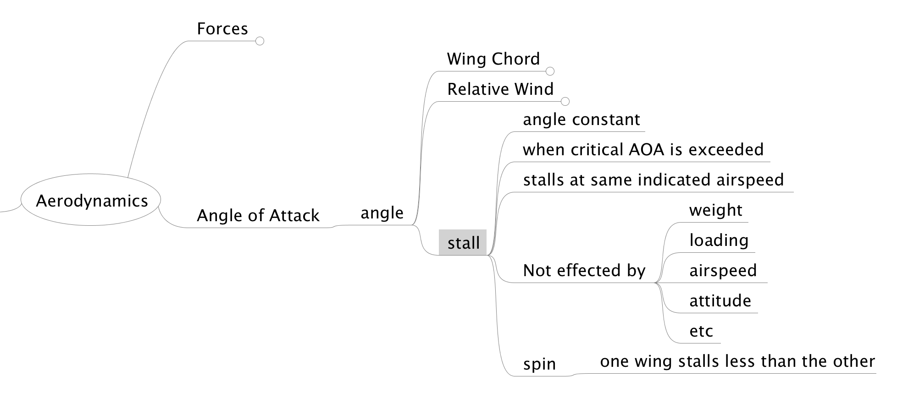


## Frost

PHAK is wrong in it's definition of frost. It states:

**Frost**. Ice crystal deposits formed by [sublimation](https://en.wikipedia.org/wiki/Sublimation_(phase_transition)) when temperature and [dewpoint](https://en.wikipedia.org/wiki/Dew_point) are below freezing.

But frost is a process of **deposition** and not _sublimation_.


If ice, snow, and frost are allowed to accumulate on the surface of an aircraft, the smooth airflow over the wing is disrupted. This causes the boundary layer to separate at an AOA lower than that of the critical angle. Lift is greatly reduced, altering expected aircraft performance. If ice is allowed to accumulate on the aircraft during flight, the weight of the aircraft is increased while the ability to generate lift is decreased. [Figure 5-40] As little as 0.8 millimeter of ice on the upper wing surface increases drag and reduces aircraft lift by 25 percent. 

* PHAK [CH12-15 Weather Theory](https://www.faa.gov/regulations_policies/handbooks_manuals/aviation/phak/media/14_phak_ch12.pdf)
	* [audio](http://ia801308.us.archive.org/35/items/pilotshandbook_1512_librivox/pilotshandbook_40_faa_128kb.mp3)

**Dew and Frost** On cool, clear, calm nights, the temperature of the ground and objects on the surface can cause temperatures of the surrounding air to drop below the dew point. When this occurs, the moisture in the air condenses and deposits itself on the ground, buildings, and other objects like cars and aircraft. This moisture is known as dew and sometimes can be seen on grass and other objects in the morning. If the temperature is below freezing, the moisture is deposited in the form of frost. While dew poses no threat to an aircraft, frost poses a definite flight safety hazard. Frost disrupts the flow of air over the wing and can drastically reduce the  production of lift. It also increases drag, which when combined with lowered lift production, can adversely affect the ability to take off. An aircraft must be thoroughly cleaned and free of frost prior to beginning a flight. 

	
[Science of frost](https://stevengoddard.wordpress.com/2010/09/04/the-freezing-point-and-the-dew-point/)


## Ground Effect

* [My Quora question](https://www.quora.com/What-is-the-physics-math-of-ground-effect-doesnt-come-into-play-until-youre-within-1-wingspan-of-the-ground-Why-is-1-wing-span-a-magic-value)
* [Effect of low Reynolds number](https://www.quora.com/What-is-the-meaning-of-Life-at-Low-Reynolds-Number)
* [Ground Effect Simulation](https://www.youtube.com/watch?v=OfibQQFskcE&feature=youtu.be)

**Ground effect**. The condition of slightly increased air pressure below an airplane wing or helicopter rotor system that increases the amount of lift produced. It exists within approximately one wing span or one rotor diameter from the ground. It results from a reduction in upwash, downwash, and wingtip vortices, and provides a corresponding decrease in induced drag.

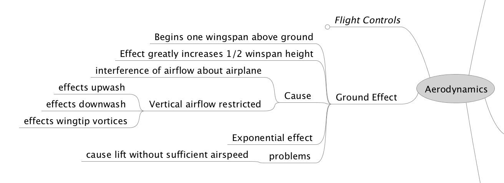


## Airplane Turn

[NASA](https://www.grc.nasa.gov/www/k-12/airplane/turns.html)

Interestingly the instructor used `centrifugal force` to describe how an aircraft turns. He must be using that to describe effects of inertia since `centrifugal force` is not an [actual force](https://www.youtube.com/watch?v=yAfg_8OLjvs) [2](http://phun.physics.virginia.edu/topics/centrifugal.html). The same discussion is had in PHAK see [Figure 5-34](https://www.faa.gov/regulations_policies/handbooks_manuals/aviation/phak/media/07_phak_ch5.pdf).

The horizontal component of lift makes and airplane turn. To attain horizontal component of lift the pilot coordinates rudder, ailerons, and elevator.

The rudder on an airplane controls the yaw, i.e. rotation about the vertical axis, but does not cause the airplane to turn.

__This is an odd statement since `yaw` is obviously a turn about the CG in the vertical axis.__ This is really just loose terminology for the word turn.


All turns are coordinated by use of ailerons, rudder, and elevator. Applying aileron pressure is necessary to place the aircraft in the desired angle of bank, while simultaneous application of rudder pressure is necessary to counteract the resultant adverse yaw. Additionally, because more lift is required during a turn than during straight-and-level flight, the angle of attack (AOA) must be increased by applying elevator back pressure. The steeper the turn, the more elevator back pressure that is needed.


Better description of turn is [here](https://www.grc.nasa.gov/www/k-12/airplane/turns.html):

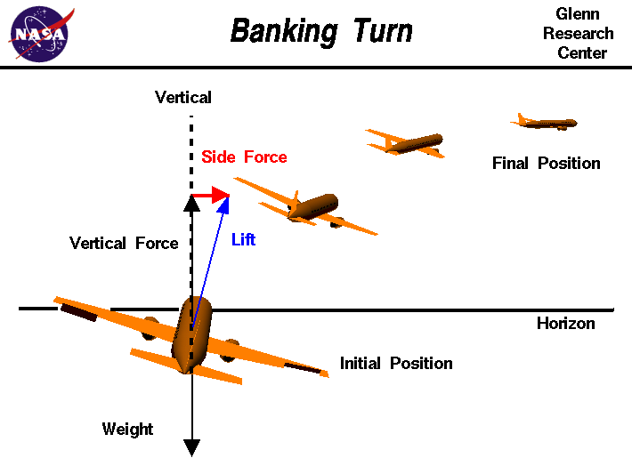

Side force component of lift causes circular flight path. A fundamental aircraft motion is a banking turn. This maneuver is used to change the aircraft heading. The turn is initiated by using the ailerons or spoilers to roll, or bank, the aircraft to one side. On the figure, the airliner is banked to the right by lowering the left aileron and raising the right aileron. The lift of the wings of the aircraft is a vector quantity which is always directed perpendicular to the flight path and perpendicular to the wings generating the lift. As the aircraft is rolled, the lift vector is tilted in the direction of the roll. We can break the lift vector into two components. One component is vertical and opposed to the weight which is always directed towards the center of the earth. The other component is an unopposed side force which is in the direction of the roll, and perpendicular to the flight path.

As long as the aircraft is banked, the side force is a constant, unopposed force on the aircraft. The resulting motion of the center of gravity of the aircraft is a circular arc. When the wings are brought level by an opposing motion of the ailerons, the side force is eliminated and the aircraft continues to fly in a straight line along a new heading. Notice that the rudder is not used to turn the aircraft. The aircraft is turned through the action of the side component of the lift force. The rudder is used during the turn to coordinate the turn, i.e. to keep the nose of the aircraft pointed along the flight path. If the rudder is not used, one can encounter an adverse yaw in which the drag on the outer wing pulls the aircraft nose away from the flight path.


## Airplane Stability

PHAK [Ch5-14 Stability](https://www.faa.gov/regulations_policies/handbooks_manuals/aviation/phak/media/07_phak_ch5.pdf)


Stability is the inherent quality of an aircraft to correct for conditions that may disturb its equilibrium and to return to or to continue on the original flight path. It is primarily an aircraft design characteristic. The flight paths and attitudes an aircraft flies are limited by the aerodynamic characteristics of the aircraft, its propulsion system, and its structural strength. These limitations indicate the maximum performance and maneuverability of the aircraft. If the aircraft is to provide maximum utility, it must be safely controllable to the full extent of these limits without exceeding the pilot’s strength or requiring exceptional flying ability. If an aircraft is to fly straight and steady along any arbitrary flight path, the forces acting on it must be in static equilibrium. The reaction of any body when its equilibrium is disturbed is referred to as stability. The two types of stability are static and dynamic.


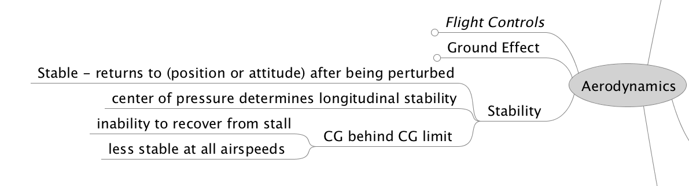


## Torque and P-Factor

The airplane engine spins the propeller in the clockwise direction (in the USA). There is an opposite force placed on the aircraft which causes the plane to want to rotate to counter-clockwise along the longitudinal axis.

Torque and P-Factor PHAK [Ch5-30](https://www.faa.gov/regulations_policies/handbooks_manuals/aviation/phak/media/pilot_handbook.pdf) To the pilot, “torque” (the left turning tendency of the airplane) is made up of four elements that cause or produce a twisting or rotating motion around at least one of the airplane’s three axes. These four elements are:

1. Torque reaction from engine and propeller
2. Corkscrewing effect of the slipstream
3. Gyroscopic action of the propeller
4. Asymmetric loading of the propeller (P-factor)

[Demonstration](https://www.youtube.com/watch?v=QGWbjGqmoWo)

The pitch of the plane effects the bite of the prop into the air which causes decreased bite on the descending (right) blade and increased bite on the ascending blade.

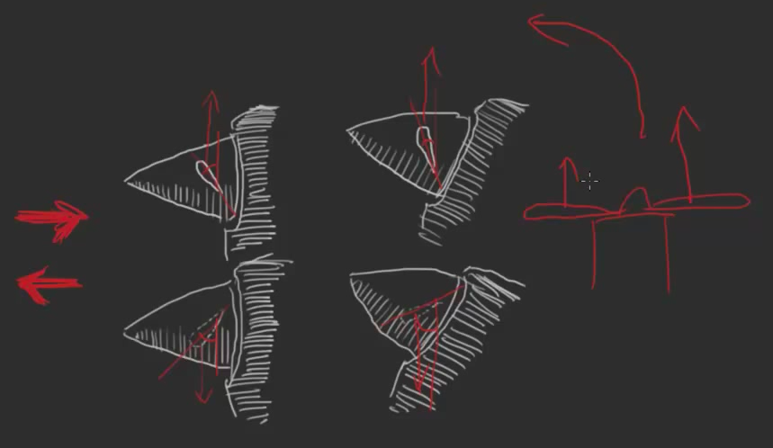


## Load Factor

Additional weight carried by the wings due to the airplanes weight plus the "centrifugal" force.

[Forces Acting On An Airplane In A Turn](https://www.youtube.com/watch?v=Oc7ViQnXkUs)

* Fl = Lift Force
* Fg = Gravity Force


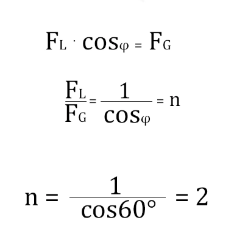


[`1/(cos 60 degrees = 2`](https://www.google.com/search?q=1%2F(cos+60)&rlz=1C5CHFA_enUS730US730&oq=1%2F(cos+60)&aqs=chrome..69i57j6j69i60.543j0j7&sourceid=chrome&ie=UTF-8#q=1/(cos+60+degrees)&*)

[`1/(cos 30 degrees = 1.015`](https://www.google.com/search?q=1%2F(cos+60)&rlz=1C5CHFA_enUS730US730&oq=1%2F(cos+60)&aqs=chrome..69i57j6j69i60.543j0j7&sourceid=chrome&ie=UTF-8#q=1/(cos+30+degrees)&*)


## Velocity Vs G-Loads


