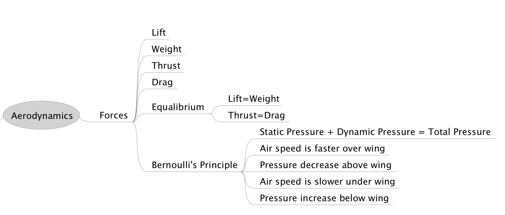

March 15 2017

**Notes**: for Gleim Private Pilot FAA Knowledge Test

# Chapter 1 - Aerodynamics

[Terms](https://www.faa.gov/regulations_policies/handbooks_manuals/aviation/phak/media/21_phak_glossary.pdf)

## Flight Controls

* PHAK [CH6 Flight Controls](https://www.faa.gov/regulations_policies/handbooks_manuals/aviation/phak/media/08_phak_ch6.pdf)
	* [Audio Primary Flight Controls](http://ia801308.us.archive.org/35/items/pilotshandbook_1512_librivox/pilotshandbook_16_faa_128kb.mp3)
	* [Audio Secondary Flight Controls](http://ia801308.us.archive.org/35/items/pilotshandbook_1512_librivox/pilotshandbook_17_faa_128kb.mp3)


* Primary Flight Controls ([video](https://www.youtube.com/watch?v=w7c2H9yUxpQ)
	* Ailerons - longitudinal axis control (roll)
	* Elevator - lateral axis control (pitch)
	* Stabilator - one piece horizontal stabilizer
	* Rudder - Vertical access control
	* Canard - lateral axis control (pitch)
* Secondary Flight Controls
	* Flaps - Increase angle of descent without increase in airspeed
	* Spoiler - 
	* Trim System - 


### Aileron

Primary flight control surfaces mounted on the trailing edge of an airplane wing, near the tip. Ailerons control roll about the longitudinal axis.

### Elevator

[Elevator](https://en.wikipedia.org/wiki/Elevator_(aeronautics)) The horizontal, movable primary control surface in the tail section, or empennage, of an airplane. The elevator is hinged to the trailing edge of the fixed horizontal stabilizer.


### Stabilator

[Stabilator](https://en.wikipedia.org/wiki/Stabilator) A single-piece horizontal tail surface on an airplane that pivots around a central hinge point. A stabilator serves the purposes of both the horizontal stabilizer and the elevators.


### Rudder

**Rudder**. The movable primary control surface mounted on the trailing edge of the vertical fin of an airplane. Movement of the rudder rotates the airplane about its vertical axis.

### Canard

**Canard**. A horizontal surface mounted ahead of the main wing to provide longitudinal stability and control. It may
be a fixed, movable, or variable geometry surface, with or without control surfaces.


**Canard configuration**. A configuration in which the span of the forward wings is substantially less than that of the main wing.

### Flaps

Flaps. Hinged portion of the trailing edge between the ailerons and fuselage. In some aircraft ailerons and flaps are interconnected to produce full-span “flaperons.” In either case, flaps change the lift and drag on the wing.


### Spolier

**Spoilers**. High-drag devices that can be raised into the air flowing over an airfoil, reducing lift and increasing drag. Spoilers are used for roll control on some aircraft. Deploying spoilers on both wings at the same time allows the aircraft to descend without gaining speed. Spoilers are also used to shorten the ground roll after landing.

### Trim System

**Trim**. To adjust the aerodynamic forces on the control surfaces so that the aircraft maintains the set attitude without any control input.

**Trim tab**. A small auxiliary hinged portion of a movable control surface that can be adjusted during flight to a position resulting in a balance of control forces.


## Aerodynamic Forces


* PHAK [CH5 Aerodynamics
of Flight](https://www.faa.gov/regulations_policies/handbooks_manuals/aviation/phak/media/07_phak_ch5.pdf)
	* [Audio](http://ia801308.us.archive.org/35/items/pilotshandbook_1512_librivox/pilotshandbook_08_faa_128kb.mp3)



* Forces acting on airplane during flight
	* Lift - Upward acting force
	* Weight - The downward acting force
	* Thrust - Forward acting Force
	* Drag - The rearward acting force


There are the force vectors in relation to an airplane:


This refinement of the old “thrust equals drag; lift equals weight” formula explains that a portion of thrust is directed upward in climbs and slow flight and acts as if it were lift while a portion of weight is directed backward opposite to the direction of flight and acts as if it were drag. In slow flight, thrust has an upward component. But because the aircraft is in level flight, weight does not contribute to drag. 


	
[Bernoulli's Principle](https://www.grc.nasa.gov/www/k-12/airplane/bern.html): ```Static Pressure + Dynamic Pressure = Total Pressure```


* [Vortex Shedding - Smarter Every Day 23](https://www.youtube.com/watch?v=ZauGjgZ0rBQ)
* [How Does A Wing Actually Work?](https://www.youtube.com/watch?v=aFO4PBolwFg) - The real story
* [Common Misconceptions in Aerodynamics](https://www.youtube.com/watch?v=QKCK4lJLQHU)


## Angle Of Attack (AOA)

* PHAK [CH6-4 Angle of Attack](https://www.faa.gov/regulations_policies/handbooks_manuals/aviation/phak/media/08_phak_ch6.pdf)


**Angle of attack**. The angle of attack is the angle at which relative wind meets an airfoil. It is the angle that is formed by the chord of the airfoil and the direction of the relative wind or between the chord line and the flight path. The angle of attack changes during a flight as the pilot changes the direction of the aircraft and is related to the amount of lift being produced. 


## Stalls and Spins

**Stall**. A rapid decrease in lift caused by the separation of airflow from the wing’s surface, brought on by exceeding the critical angle of attack. A stall can occur at any pitch attitude or airspeed.

**Spin**. An aggravated stall that results in an airplane descending in a helical, or corkscrew path.


***An airplane in a given configuration will tall at the same indicated airspeed regardless of altitude because the airspeed indicator is directly related to air density.***


## Frost

PHAK is wrong in it's definition of frost. It states:

**Frost**. Ice crystal deposits formed by [sublimation](https://en.wikipedia.org/wiki/Sublimation_(phase_transition)) when temperature and [dewpoint](https://en.wikipedia.org/wiki/Dew_point) are below freezing.

But frost is a process of **deposition** and not _sublimation_.


If ice, snow, and frost are allowed to accumulate on the surface of an aircraft, the smooth airflow over the wing is disrupted. This causes the boundary layer to separate at an AOA lower than that of the critical angle. Lift is greatly reduced, altering expected aircraft performance. If ice is allowed to accumulate on the aircraft during flight, the weight of the aircraft is increased while the ability to generate lift is decreased. [Figure 5-40] As little as 0.8 millimeter of ice on the upper wing surface increases drag and reduces aircraft lift by 25 percent. 

* PHAK [CH12-15 Weather Theory](https://www.faa.gov/regulations_policies/handbooks_manuals/aviation/phak/media/14_phak_ch12.pdf)
	* [audio](http://ia801308.us.archive.org/35/items/pilotshandbook_1512_librivox/pilotshandbook_40_faa_128kb.mp3)

**Dew and Frost** On cool, clear, calm nights, the temperature of the ground and objects on the surface can cause temperatures of the surrounding air to drop below the dew point. When this occurs, the moisture in the air condenses and deposits itself on the ground, buildings, and other objects like cars and aircraft. This moisture is known as dew and sometimes can be seen on grass and other objects in the morning. If the temperature is below freezing, the moisture is deposited in the form of frost. While dew poses no threat to an aircraft, frost poses a definite flight safety hazard. Frost disrupts the flow of air over the wing and can drastically reduce the  production of lift. It also increases drag, which when combined with lowered lift production, can adversely affect the ability to take off. An aircraft must be thoroughly cleaned and free of frost prior to beginning a flight. 

	
[Science of frost](https://stevengoddard.wordpress.com/2010/09/04/the-freezing-point-and-the-dew-point/)


## Ground Effect

[Ground Effect Simulation](https://www.youtube.com/watch?v=OfibQQFskcE&feature=youtu.be)


## Airplane Turn

## Airplane Stability

## Torque and P-Factor

## Load Factor

## Velocity Vs G-Loads