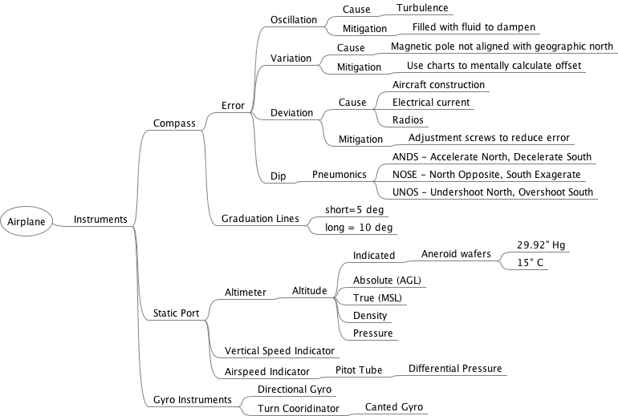
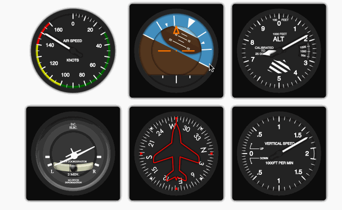
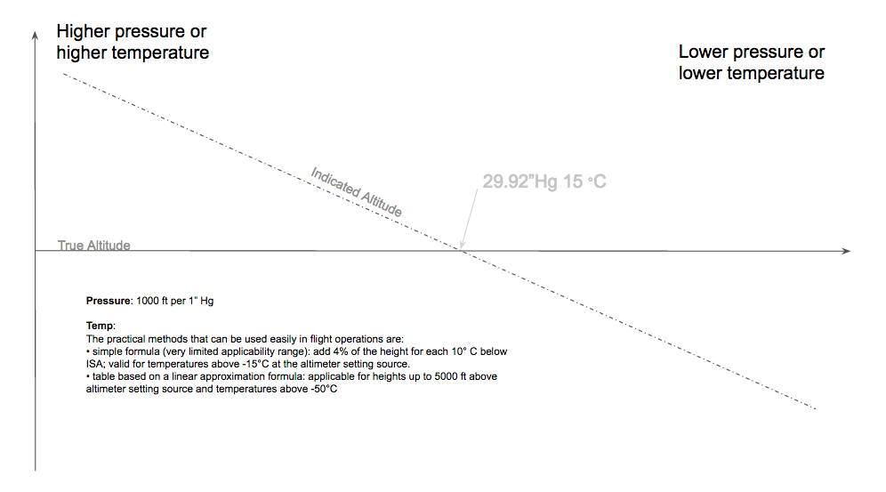

March 15 2017

# Chapter 2 - Airplanes Instruments, Engines, and System

## Instruments

* ASI - Airspeed Indicator
* VSI Vertical Speed Indicator
* Altimeter
* Magnetic Compass
* Gyro Based Instruments
	* DG - Direction Gyro, AKA Heading Indicator
	* Turn Coordinator  (Canted Gyro)

	

### Airspeed Indicator (ASI)

* Speed Indications
	* White Arc - Full flap operating range
		* Lower Limit Vs₀ - Landing Configuration
		* Upper Limit Vfe - Max full flaps extend
	* Green Arc - Normal Operation range
		* Vs1 - power off stalling speed
		* Vno - normal operation
	* Yellow Arc - Only in smooth air
	* Red radial
		* Vne - Never Exceed
	* Va - Design Maneuvering Speed (most important)
	

### Vertical Speed Indicator (VSI)

### Altimeter

[§ 91.411](http://rgl.faa.gov/Regulatory_and_Guidance_Library/rgFar.nsf/FARSBySectLookup/91.411) Altimeter system and altitude reporting equipment tests and inspections.

An altimeter has two or three hands depending on the aircraft

* Short Needle 10K ft
* Medium Needle 1K ft
* Long Needle 100 ft

Many altimeters have a `cross hatch` to indicate altitude below 10K ft MSL.

Changes in pressure and/or temperature effect the indicated altitude:

#### Altitude Types

* Absolute (AGL)
* True (MSL)
	* True = Pressure _during standard atmospheric conditions (29.92" Hg and 15 °C at sea level)_
* Density
	* Density = Pressure corrected for non standard temp
* Pressure
	* height above standard datum plane of 29.92" Hg
	* Same as Density at standard temperature
* Indicated
	* 1,000 ft for 1 in of pressure

##### Density Altitude

[Density Altitude](https://en.wikipedia.org/wiki/Density_altitude) formula

* where
	* DA = density altitude in meters
	* P= atmospheric (static) pressure
	* Psl= standard sea level atmospheric pressure (1013.25 hPa ISA or 29.92126 inHg US))
	* T = true (static) air temperature in kelvins (K) [add 273.15 to the Celsius (°C)] figure
	* Tsl = ISA standard sea level air temperature in kelvins (K) (288.15 K)
	* Gamma = lapse rate (0.0065 K/m)
	* R = gas constant (8.31432 J/mol/K)
	* g = gravity (9.80665 m/s²)
	* M = molar mass of dry air (0.0289644 kg/mol)

### Magnetic Compass 

* Required for both VFR and IFR § 25.1303 (a3) Flight and navigation instruments.

**Turning Error**

PHAK - [Ch8-22](https://www.faa.gov/regulations_policies/handbooks_manuals/aviation/phak/media/10_phak_ch8.pdf)
	* Compass [Audio](http://ia801308.us.archive.org/35/items/pilotshandbook_1512_librivox/pilotshandbook_30_faa_128kb.mp3)

[Discussion](https://www.youtube.com/watch?v=6iWqUIW87l8)

* Turning North stop 15° early
* Turning South stop 15° late + (latitude/2)

* Types of errors
	* Oscillation
	* Variation
	* Deviation
	* Dip

#### Oscillation

Oscillation comes from turbulence. To reduce oscillation the compass is filled with fluid to dampen some of the oscillation.

#### Variation

Variation is due to magnetic north not being directly aligned with Earths "true north".

#### Deviation

Deviation occurs due to interference from structure and equipment inside the plane.

There are two screws on the compass that allows it to be adjusted to reduce the amount of deivation interference.

#### Dip

* [PHAK 8-26](https://www.faa.gov/regulations_policies/handbooks_manuals/aviation/phak/media/10_phak_ch8.pdf)
* [Dip Error](https://en.wikipedia.org/wiki/Aircraft_compass_turns#Magnetic_dip)

The Earth's magnetic field runs parallel to its surface only at the Magnetic Equator, which is the point halfway between the Magnetic North and South Poles. As you move away move away from the Magnetic Equator towards the magnetic poles the angle created b y the vertical pull of the Earth's magnetic field in relation to the Earths surface creates gradually. This angle is known as the **dip angle** The dip angle increases in the downward direction as you move towards the Magnetic North Pole and increases in the upward direction as you move toward the Magnetic South Pole.

**Acceleration Error:**

[Video](https://www.youtube.com/watch?v=vUz09IpYCuY)

* WE ANDS - Accelerate errors North, Decelerate errors South
	* Heading E<->W - acceleration error occurs
		* Accelerate - false turn north indicated
		* Decelerate - false turn south indicated
	* Heading N<->S - Acceleration error does not occur

**Turning Error: **

[Video](https://www.youtube.com/watch?v=WqXujnDw-kE)

* NOSE
	* North errors Opposite
	* South errors Exaggerate

* UNOS
	* Undershoot North
	* Overshoot South

* A northernly turn should be stopped prior to arrival at the desired heading.
	* Rule of thumb: stop the turn 15 degrees plush half the latitude
* A southernly turn compass lags so need to overshoot 
 	* Rule of thumb: overshoot the turn 15 degrees plush half the latitude

Remember the mnemonic WE ANDS. When the aircraft is on an east or west heading and it is decelerated, the magnetic compass will normally indicate a turn to the south.

There is no compass error when initiating a turn from an east or west heading.

WE ANDS - when flying West or East, if you Accelerate the compass will show a turn to the North. If you decelerate, the compass will show a turn to the South.

### Gyro Instruments

Several instruments use gyro's.

#### Attitude Indicator

#### Directional Gyro (DG)

#### Turn Coordinator

