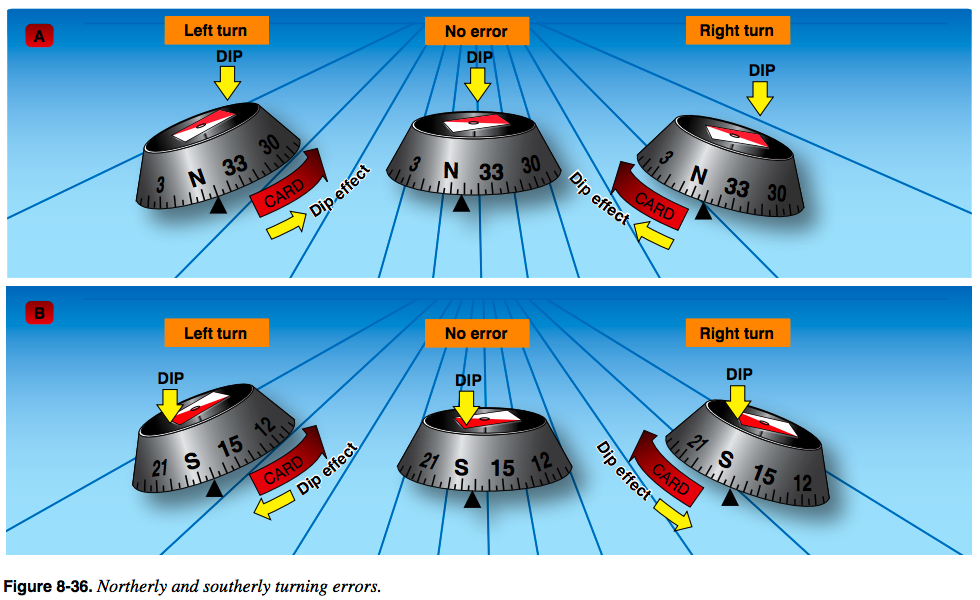
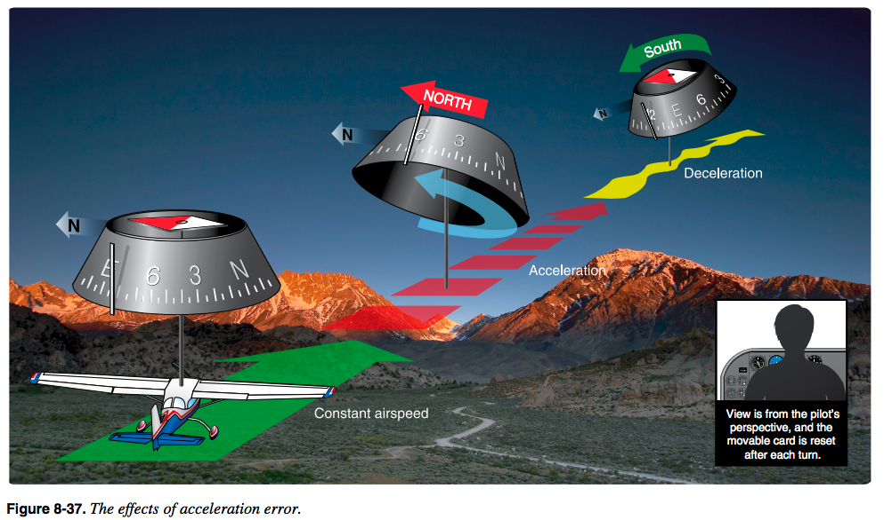

March 15 2017

# Chapter 2 - Airplanes Instruments, Engines, and System

## Compass Turning Error

PHAK - [Ch8-22](https://www.faa.gov/regulations_policies/handbooks_manuals/aviation/phak/media/10_phak_ch8.pdf)
	* Compass [Audio](http://ia801308.us.archive.org/35/items/pilotshandbook_1512_librivox/pilotshandbook_30_faa_128kb.mp3)

[Discussion](https://www.youtube.com/watch?v=6iWqUIW87l8)

* Turning North stop 15° early
* Turning South stop 15° late + (latitude/2)

* Types of errors
	* Oscillation
	* Variation
	* Deviation
	* Dip

### Oscillation

Oscillation comes from turbulence. To reduce oscillation the compass is filled with fluid to dampen some of the oscillation.

### Variation

Variation is due to magnetic north not being directly aligned with Earths "true north".

### Deviation

Deviation occurs due to interference from structure and equipment inside the plane.

There are two screws on the compass that allows it to be adjusted to reduce the amount of deivation interference.

### Dip

**Acceleration:**

* NOSE
	* North Opposite
	* South Exaggerate
	
* UNOS
	* Undershoot North
	* Overshoot South

* WE ANDS - Accelerate North, Decelerate South
	* Heading N<->S - Acceleration error does not occur
	* Heading E<->W - acceleration error occurs

Remember the mnemonic WE ANDS. When the aircraft is on an east or west heading and it is decelerated, the magnetic compass will normally indicate a turn to the south.

There is no compass error when initiating a turn from an east or west heading.

WE ANDS - when flying West or East, if you Accelerate the compass will show a turn to the North. If you decelerate, the compass will show a turn to the South.

## Instruments

* Primary & Secondary

