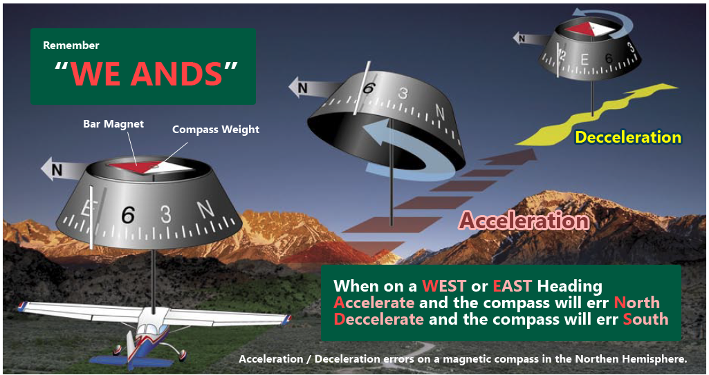

March 15 2017

# Chapter 2 - Airplanes Instruments, Engines, and System

## Compass Turning Error

PHAK - [Ch8-22](https://www.faa.gov/regulations_policies/handbooks_manuals/aviation/phak/media/10_phak_ch8.pdf)
	* Compass [Audio](http://ia801308.us.archive.org/35/items/pilotshandbook_1512_librivox/pilotshandbook_30_faa_128kb.mp3)

* Turning North stop 15° early
* Turning South stop 15° late + (latitude/2)

**Acceleration:**

* ANDS - Accelerate North, Decelerate South
* N<->S - no acceleration error does not occur
* E<->W - acceleration error occurs

